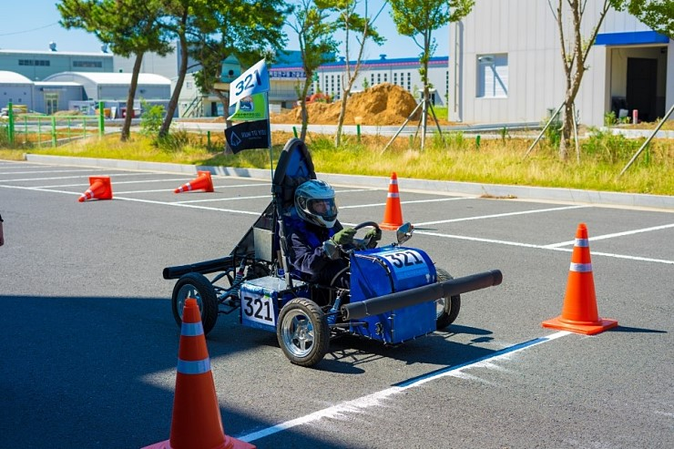

## Position
#### Member of the frame team
- As a new member, I acquired fabrication skills such as welding, grinding, soldering, and polishing.
- I learned about various mechanical components like bolts & nuts, bearing, gears, rod ends visiting Machine Tools Trade Complex at Guro.
- I understood the structure, significant components, and mechanisms of automotive.

## Tech
Fabrication skills: Arc welding, grinding, soldering, hammering, and polishing (with a grinder)

## Duration
2018/08/17 ~ 2018/08/19 (Competition)

2018/03/12 ~ 2018/08/16 (Preparation)

2018/08/20 ~ 2018/08/31 (Feedback)

