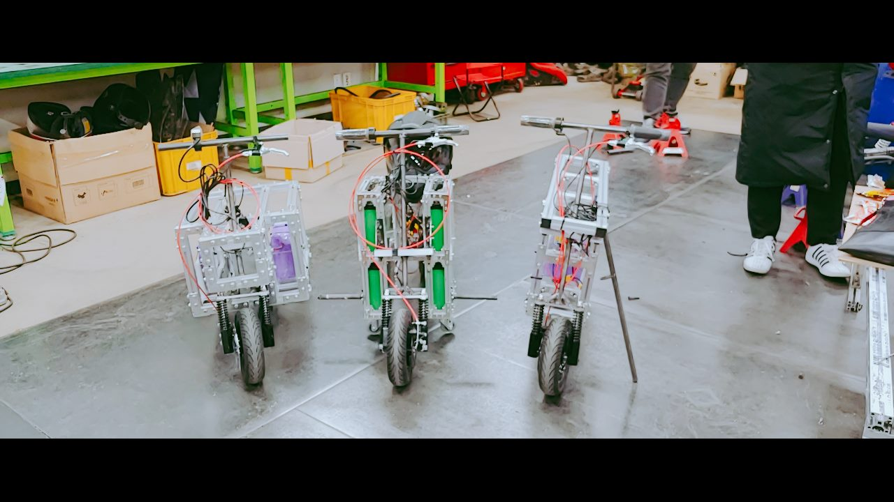

## Explanation
- We designed a light and easy-to-drive ‘box car’ that can run freely on campus.

- It was made of aluminum profiles to create a light and easy-to-assembly car.

- I Participated in the design of the frame using Solidworks, assembly, and performance tests.

## Tech
Design: Solidworks

Fabrication skills: Arc welding, Assembly

## Duration
2018/09/01 ~ 2018/12/15 (Design & Production)

2018/12/17 ~ 2018/12/18 (Presentation at Daejeon)

  <video autoplay muted loop>
    <!-- muted는 처음 화면 떴을 때 소리제거해주는 거. -->
  <source src="../assets/img/maker.mp4" type="video/mp4">
  </video>  

