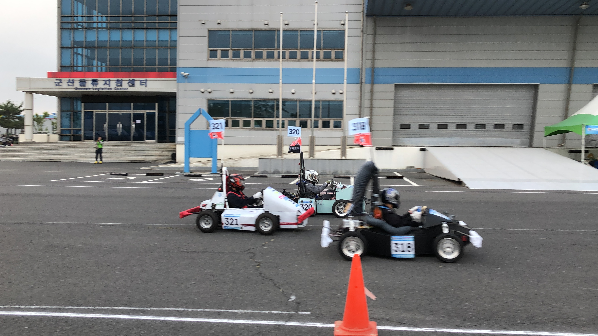
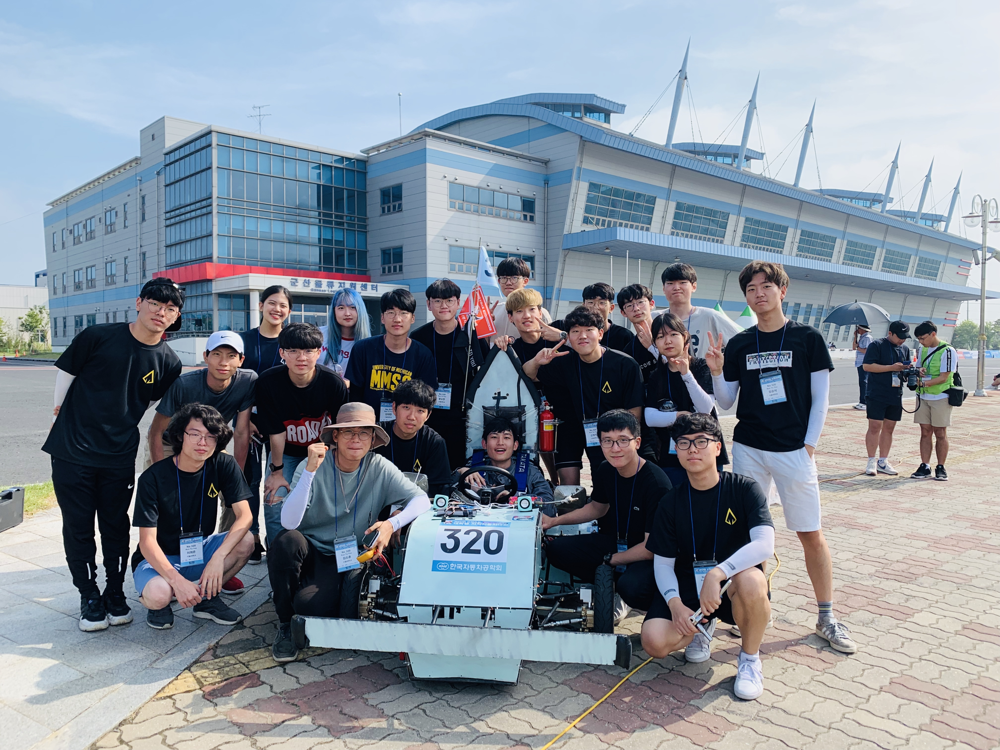

## Position
#### Member of the powertrain team
- I designed differential gear & turnbuckle system using Solidworks to maximize range in chain tension considering manufacturability.
- I designed a rear wishbone system and jig for welding
- We considered various methods to measure the velocity of the car. (In conclusion, the most accurate way was to use GPS on a cell phone.)

1) I tried to calculate the car's velocity with MATLAB using acceleration data acquired from a smartphone.

2) We tried various Arduino circuits like speedometer using tachometer, speed-calculator by receiving data from smartphone wirelessly, etc.

#### Attendance Manager
- I monitored attendance to help people management and production planning.

## Tech
Design: Solidworks

Making speedometer: Arduino, MATLAB

Fabrication skills: Arc welding, grinding, soldering, hammering, and polishing (with a grinder)

Attendance management: Microsoft Excel

## Duration
2019/08/16 ~ 2019/08/18 (Competition)

2018/09/01 ~ 2019/02/01 (Design)

2019/02/01 ~ 2019/08/16 (Production)

2018/08/17 ~ 2018/08/31 (Feedback)

