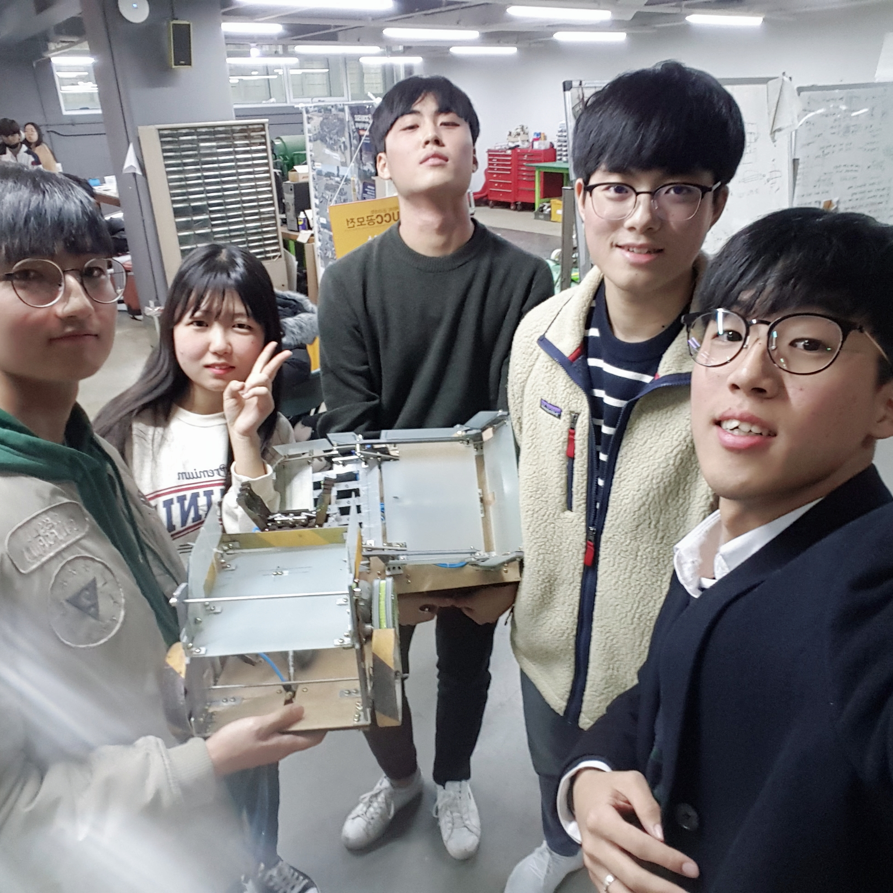

## Explanation
- All first-year mechanical students compete by designing robots with a given power source, limited material, and size constraints.

- I played a role in designing robots with Solidworks to meet the standards, reflecting my teammates' ideas.

- I considered manufacturability based on my experience of making products in the club 'Run To You'.

- In the contest, I manipulated a robot using a pneumatic cylinder.

## Tech
Design: Solidworks

Fabrication skills: Drilling, Table-Sawing, Assembly

Blueprint for laser-cutting: AutoCAD

## Duration
2018/10/19 ~ 2018/11/22 (Design & Production)

2018/11/23 (Contest)

2018/11/24 ~ 2018/11/30 (Design review)

  <video autoplay controls muted>
  <source src="../assets/img/ced_angel.mp4" type="video/mp4">
  </video>  

  <video autoplay controls muted>
  <source src="../assets/img/ced_contest.mp4" type="video/mp4">
  </video>  

