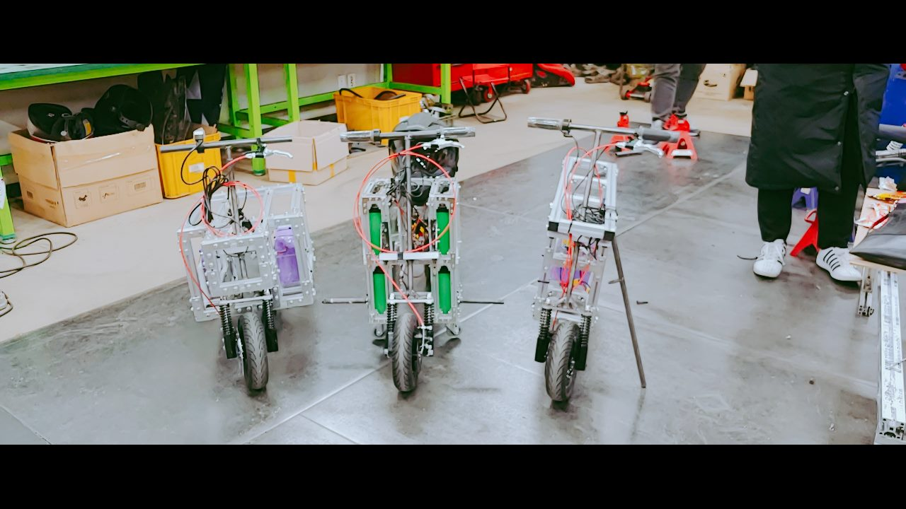

## Explanation
- We designed a light and easy-to-drive ‘box car’ that can run freely on campus.

- It was made of aluminum profiles to create a light and easy-to-assembly car.

- I Participated in the design of the frame using Solidworks, assembly, and performance tests.

- It was able to climb a steep slope. The speed was fast enough to travel quickly inside the campus, and the braking was good. However, I didn't drive well in the video because I didn't have a driver's license yet.

## Tech
Design: Solidworks

Fabrication skills: Arc welding, Assembly

## Duration
2018/09/01 ~ 2018/12/15 (Design & Production)

2018/12/17 ~ 2018/12/18 (Presentation at Daejeon)

  <video autoplay controls muted>
  <source src="../assets/img/maker.mp4" type="video/mp4">
  </video>  

